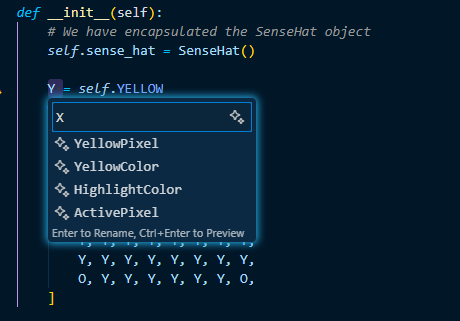
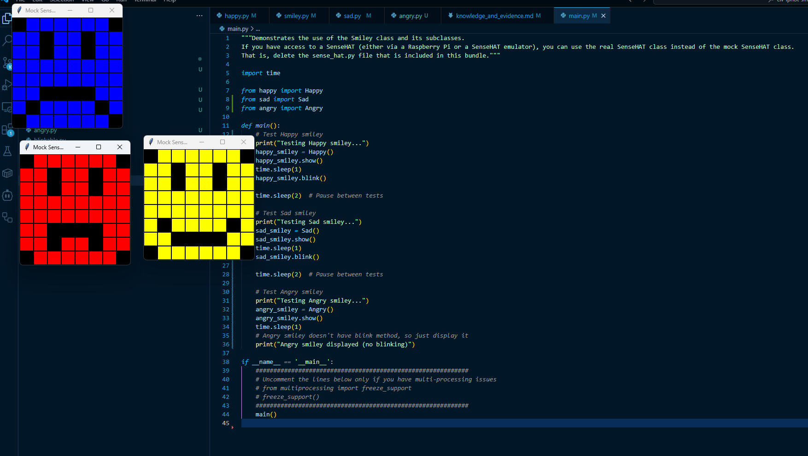

# Evidence and Knowledge

This document includes instructions and knowledge questions that must be completed to receive a *Competent* grade on this portfolio task.

## 1. Required evidence

### 1.1. Answer all questions in this document

- Each answer should be complete, well-articulated, and within the specified word count limits (if added) for each question.
- Please make sure **all** external sources are properly cited.
- You must **use your own words**. Please include your full chat transcripts if you use generative AI in any way.
- Generative AI hallucinates, is not an authoritative source

### 1.2. Make all the required modifications to the code

- Please follow the instructions in this document to make the changes needed to the code.

- When requested to upload evidence, upload all screenshots to `screenshots/` and embed them in this document. For example:

```markdown

```


> Note the `!`, and the use of a relative path.

- You must upload the code into your GitHub repository.
- While you can use a branch, your code should be in main when you submit.
- Upload a zip of this repository to Blackboard when you are ready to submit.
- You will be notified of your result via Blackboard
- However, if using GitHub classrooms, you may also receive additional feedback on GitHub directly

### 1.3. Optional: Use of Raspberry Pi and SenseHat

Raspberry Pi or SenseHat is **optional** for this activity. You can use the included `sense_hat.py` file to simulate the SenseHat on your computer.

If you use a Pi, please **delete** the `sense_hat.py` file.

### 1.4. Accessible version of the code

This project relies on visual patterns that appear on an LED matrix. If you have any accessibility requirements, you can use the `udl/accessible` branch to complete the project. This branch provides an accessible code version that uses text-based patterns instead of visual ones.

Please discuss this with your lecturer before using that branch.

## 2. Specific Tasks & Questions

Address the following tasks and questions based on the code provided in this repository.

### 2.1. Set up the project locally

1. Fork this repository (if not using GitHub Classrooms)
2. Clone your repository locally
3. Run the project locally by executing the `main.py` file
4. Evidence this by providing screenshots of the project directory structure and the output of the `main.py` file


If you are running on a Raspberry Pi, you can use the following command to run the project and then screenshot the result:

```bash
ls
python3 main.py
```

### 2.2. Fundamental code comprehension

 Answer each of the following questions **as they relate to that code** supplied by in this repository (ignore `sense_hat.py`):

1. Examine the code for the `smiley.py` file and provide  an example of a variable of each of the following types and their corresponding values (`_` should be replaced with the appropriate values):

   | Type                    | name       | value          |
   | ----------              | ---------- | -------------- |
   | built-in primitive type | 255        |  255           |
   | built-in composite type | self.pixels|  [O, Y, Y, Y, Y, Y, Y, O, ...]             |
   | user-defined type       | self.sense_hat |  SenseHat()    |

2. Fill in (`_`) the following table based on the code in `smiley.py`:

   | Object                   | Type                    |
   | ------------             | ----------------------- |
   | self.pixels              | list                    |
   | A member of self.pixels  | tuple                   |
   | self                     | Smiley                  |

3. Examine the code for `smiley.py`, `sad.py`, and `happy.py`. Give an example of each of the following control structures using an example from **each** of these files. Include the first line and the line range:

   | Control Flow | File       | First line  | Line range  |
   | ------------ | ---------- | ----------- | ----------- |
   |  sequence    |  smiley.py | def __init__(self): | 8-24        |
   |  selection   | sad.py     | if wide_open:       | 20-24       |
   |  iteration   | happy.py   | for pixel in mouth: | 18-19       |

4. Though everything in Python is an object, it is sometimes said to have four "primitive" types. Examining the three files `smiley.py`, `sad.py`, and `happy.py`, identify which of the following types are used in any of these files, and give an example of each (use an example from the code, if applicable, otherwise provide an example of your own):

   | Type                    | Used? | Example |
   | ----------------------- | ----- | --------|
   | int                     | Yes   | 255 (in color tuples)          |
   | float                   | Yes   | 0.25 (default delay in happy.py)          |
   | str                     | No    | "Hello World"          |
   | bool                    | Yes   | True (wide_open parameter)          |

5. Examining `smiley.py`, provide an example of a class variable and an instance variable (attribute). Explain **why** one is defined as a class variable and the other as an instance variable.

> **Class variable example:** `WHITE = (255, 255, 255)` - This is defined as a class variable because all smiley instances share the same color definitions. These are constants that don't change between different smiley objects.
>
> **Instance variable example:** `self.pixels` - This is defined as an instance variable because each smiley object needs its own unique pixel array. Different smiley types (Happy, Sad) will have different pixel patterns, so each instance must maintain its own state.
>

6. Examine `happy.py`, and identify the constructor (initializer) for the `Happy` class:
   1. What is the purpose of a constructor (in general) and this one (in particular)?

   > **General purpose:** A constructor initializes a new instance of a class, setting up its initial state and attributes. **This constructor specifically:** The Happy class constructor initializes a happy smiley by calling the parent Smiley constructor to set up the basic smiley structure, then customizes it by drawing the specific mouth and eyes that make it appear happy.
   >

   2. What statement(s) does it execute (consider the `super` call), and what is the result?

   > The constructor executes three statements: `super().__init__()` which calls the parent Smiley constructor to initialize the basic yellow smiley face and SenseHat object; `self.draw_mouth()` which draws the happy mouth by blanking specific pixels; and `self.draw_eyes()` which draws open eyes. The result is a fully initialized Happy smiley object with a smiling mouth and open eyes ready to be displayed.
   >

### 2.3. Code style

1. What code style is used in the code? Is it likely to be the same as the code style used in the SenseHat? Give to reasons as to why/why not:

> The code uses **PEP 8** (Python Enhancement Proposal 8) style conventions. It is likely to be the same as the SenseHat library because: 1) PEP 8 is the official Python style guide that most Python libraries follow for consistency, and 2) Both are Python projects that would benefit from following the same widely-accepted standards for readability and maintainability.
>

2. List three aspects of this convention you see applied in the code.

> 1. **Snake_case naming:** Class methods and variables use lowercase with underscores (e.g., `draw_mouth`, `wide_open`, `sense_hat`)
> 2. **UPPER_CASE constants:** Class constants are in all capitals (e.g., `WHITE`, `YELLOW`, `RED`, `BLANK`)
> 3. **Proper indentation:** Consistent 4-space indentation is used throughout the code for code blocks and method definitions
>

3. Give two examples of organizational documentation in the code.

> 1. **Docstrings:** Methods include triple-quoted docstrings explaining their purpose, such as `"""Renders a mouth by blanking the pixels that form that object."""` in the `draw_mouth` method
> 2. **Class docstrings:** Classes have descriptive docstrings like `"""Provides a Smiley with a happy expression"""` in the Happy class to explain the class purpose
>

### 2.4. Identifying and understanding classes

> Note: Ignore the `sense_hat.py` file when answering the questions below

1. List all the classes you identified in the project. Indicate which classes are base classes and which are subclasses. For subclasses, identify all direct base classes.
  
  Use the following table for your answers:

| Class Name | Super or Sub? | Direct parent(s) |
| ---------- | ------------- | ---------------- |
| Smiley     | Super         | None             |
| Blinkable  | Super         | ABC              |
| Happy      | Sub           | Smiley, Blinkable|
| Sad        | Sub           | Smiley           |

2. Explain the concept of abstraction, giving an example from the project (note "implementing an ABC" is **not** in itself an example of abstraction). (Max 150 words)

> Abstraction hides complex implementation details while exposing only the essential features needed by users. In this project, the `show()` method in the Smiley class demonstrates abstraction. When a user calls `smiley.show()`, they don't need to understand the complex details of how the SenseHat hardware works, pixel arrays are formatted, or LED matrices are controlled. The method abstracts away all the technical complexity of interacting with the hardware and simply provides a clean, simple interface. Users can display any smiley type without knowing about RGB values, pixel positioning, or hardware communication protocols. This abstraction makes the code easier to use and understand.
>

3. What is the name of the process of deriving from base classes? What is its purpose in this project? (Max 150 words)

> The process is called **inheritance**. Its purpose in this project is to enable code reuse and establish relationships between classes. The Happy and Sad classes inherit from the Smiley base class, automatically gaining access to common functionality like color definitions, the SenseHat object, pixel array, and display methods. This eliminates code duplication since both subclasses can use the same basic smiley structure and display logic. Inheritance also enables polymorphism - both Happy and Sad objects can be treated as Smiley objects, allowing them to be used interchangeably in code that expects a Smiley. Additionally, inheritance creates a logical hierarchy that reflects real-world relationships: Happy and Sad are both types of Smileys, sharing common characteristics while having their own unique features.
>

### 2.5. Compare and contrast classes

Compare and contrast the classes Happy and Sad.

1. What is the key difference between the two classes?
   > The key difference is in their **inheritance structure and capabilities**: Happy inherits from both Smiley and Blinkable (multiple inheritance), giving it blinking functionality, while Sad only inherits from Smiley and cannot blink. Additionally, they have different **facial expressions** - Happy draws a smiling mouth with upward curves, while Sad draws a frowning mouth with downward curves.
   >
2. What are the key similarities?
   > Both classes inherit from the same Smiley base class, so they share: the same basic structure and initialization process (calling `super().__init__()`), the same color scheme (yellow), identical `draw_eyes()` method implementations, similar constructor patterns that call `draw_mouth()` and `draw_eyes()`, and the same ability to be displayed using the inherited `show()` method.
   >
3. What difference stands out the most to you and why?
   > The **blinking capability** stands out most because it represents a fundamental functional difference rather than just a visual one. While the mouth differences are cosmetic (different pixel patterns), the blinking ability demonstrates different behavioral capabilities. Happy can perform actions (blinking) that Sad cannot, showing how inheritance design choices directly impact what objects can do.
   >
4. How does this difference affect the functionality of these classes
   > The inheritance difference means Happy objects can be used in contexts that expect blinkable objects (polymorphism with Blinkable interface), while Sad objects cannot. This limits where Sad objects can be used in code that relies on blinking functionality. The facial expression differences affect the visual output but not the programmatic interface - both can still be displayed and manipulated in the same ways through their shared Smiley interface.
   >

### 2.6. Where is the Sense(Hat) in the code?

1. Which class(es) utilize the functionality of the SenseHat?
   > The **Smiley** class and all its subclasses (Happy and Sad) utilize SenseHat functionality. Since Happy and Sad inherit from Smiley, they automatically gain access to the SenseHat capabilities through inheritance.
   >
2. Which of these classes directly interact with the SenseHat functionalities?
   > Only the **Smiley** class directly interacts with the SenseHat. It creates the SenseHat object in its constructor (`self.sense_hat = SenseHat()`) and calls SenseHat methods like `set_pixels()` in the `show()` method and `low_light` property in the `dim_display()` method. The subclasses (Happy and Sad) never directly access SenseHat methods.
   >
3. Discuss the hiding of the SenseHAT in terms of encapsulation (100-200 Words)
   > The SenseHAT is excellently encapsulated within the Smiley class, demonstrating proper object-oriented design. The SenseHat object is stored as a private instance variable (`self.sense_hat`) and is never exposed directly to external code or subclasses. Instead, the Smiley class provides controlled access through public methods like `show()` and `dim_display()` that internally handle all SenseHat interactions. This encapsulation provides several benefits: it hides the complexity of hardware communication from users, protects the SenseHat object from direct manipulation that could cause errors, allows the implementation to change without affecting client code, and provides a clean, simple interface for displaying smileys. Users and subclasses can work with smileys without knowing anything about the underlying hardware details, RGB values, or LED matrix protocols. This separation of concerns makes the code more maintainable and easier to understand.
   >

### 2.7. Sad Smileys Can’t Blink (Or Can They?)

Unlike the `Happy` smiley, the current implementation of the `Sad` smiley does not possess the ability to blink. Let's first explore how blinking has been implemented in the Happy Smiley by examining the blink() method, which takes one argument that determines the duration of the blink.

**Understanding Blink Mechanism:**

1. Does the code's author believe that every `Smiley` should be able to blink? Explain.

> No, the author does not believe every Smiley should be able to blink. This is evident because: 1) The blink functionality is not implemented in the base Smiley class, 2) The Blinkable class exists as a separate abstract base class that must be explicitly inherited, and 3) The Sad class does not inherit from Blinkable and has no blink method. The author designed blinking as an optional capability that specific smiley types can choose to implement.
>

2. For those smileys that blink, does the author expect them to blink in the same way? Explain.

> Yes, the author expects consistent blinking behavior through the Blinkable abstract base class. The Blinkable ABC defines a contract with an abstract `blink()` method that all implementing classes must provide. This ensures that any class claiming to be "blinkable" will have a blink method with a consistent interface, though the specific implementation details can vary between different smiley types.
>

3. Referring to the implementation of blink in the Happy and Sad Smiley classes, give a brief explanation of what polymorphism is.

> Polymorphism allows objects of different types to be treated uniformly through a common interface. Currently, only Happy has a blink method (Sad doesn't), but if both had blink methods, you could call `smiley.blink()` on any smiley object without knowing its specific type. The correct blink implementation would be called automatically based on the object's actual type - this is polymorphism in action. Different classes can have different implementations of the same method name.
>

4. How is inheritance used in the blink method, and why is it important for polymorphism?

> Inheritance allows the Happy class to inherit the abstract blink method contract from the Blinkable ABC, which it must then implement. This inheritance relationship is crucial for polymorphism because it establishes a common interface - any object that inherits from Blinkable is guaranteed to have a blink method. This allows code to treat all blinkable objects uniformly, calling blink() on any blinkable smiley without knowing the specific implementation details.
>
1. **Implement Blink in Sad Class:**

   - Create a new method called `blink` within the Sad class. Ensure you use the same method signature as in the Happy class:

   ```python
   def blink(self, delay=0.25):
       pass  # Replace 'pass' with your implementation
   ```

2. **Code Implementation:** Implement the code that allows the Sad smiley to blink. Use the implementation from the Happy Smiley as a reference. Ensure your new method functions similarly by controlling the blink duration through the `delay` argument.

3. **Testing the Implementation:**

- Test the new blink functionality on your Raspberry Pi or within the Python classes provided. You might need to adjust the `main.py` script to incorporate Sad Smiley's new blinking capability.

Include a screenshot of the sad smiley or the modified `main.py`:


- Observe and document the Sad smiley as it blinks its eyes. Describe any adjustments or issues encountered during implementation.

  > The main.py was currently set up only to run the Happy smiley, not the Sad smiley. To test the Sad smiley's blinking functionality, I had to modify main.py to import the Sad class and create a Sad instance. Once this was done, the Sad smiley displayed with its frowning mouth and blinked correctly when the blink() method was called. The eyes closed for 0.25 seconds then opened again. The implementation worked without any issues.

  ### 2.8. If It Walks Like a Duck…

  Previously, you implemented the blink functionality for the Sad smiley without utilizing the class `Blinkable`. Assuming you did not use `Blinkable` (even if you actually did), consider how the Sad smiley could blink similarly to the Happy smiley without this specific class.

  1. **Class Type Analysis:** What kind of class is `Blinkable`? Inspect its superclass for clues about its classification.

     > `Blinkable` is an **Abstract Base Class (ABC)**. This is evident from its superclass being `ABC` (from the abc module) and containing an abstract method `blink()` decorated with `@abstractmethod`. It defines a contract that other classes must follow but provides no concrete implementation itself.

  2. **Class Implementation:** `Blinkable` is a class intended to be implemented by other classes. What generic term describes this kind of class, which is designed for implementation by others? **Clue**: Notice the lack of any concrete implementation and the naming convention.

  > This is called an **interface** or **abstract base class**. It defines a contract specifying what methods implementing classes must provide, but contains no concrete implementation. The "-able" suffix in "Blinkable" is a common naming convention for interfaces, indicating a capability or behavior that classes can implement.

  3. **OO Principle Identification:** Regarding your answer to question (2), which Object-Oriented (OO) principle does this represent? Choose from the following and justify your answer in 1-2 sentences: Abstraction, Polymorphism, Inheritance, Encapsulation.

  > This represents **Abstraction**. The Blinkable ABC abstracts the concept of "blinking behavior" by defining what it means to be blinkable (having a blink method) without specifying how the blinking should be implemented. It separates the interface (what) from the implementation (how).

  4. **Implementation Flexibility:** Explain why you could grant the Sad Smiley a blinking feature similar to the Happy Smiley's implementation, even without directly using `Blinkable`.

  > Python's dynamic typing allows objects to be used based on their behavior rather than their declared type. As long as the Sad class has a `blink()` method with the correct signature, it can be used anywhere that expects a blinkable object. The method doesn't need to be inherited from Blinkable - it just needs to exist and be callable.

  5. **Concept and Language Specificity:** In relation to your response to question (4), what is this capability known as, and why is it feasible in Python and many other dynamically typed languages but not in most statically typed programming languages like C#? **Clue** This concept is hinted at in the title of this section.

  > This is called **Duck Typing** ("If it walks like a duck and quacks like a duck, then it's a duck"). In Python, if an object has the required methods, it can be used regardless of its actual type. This works in dynamically typed languages because type checking happens at runtime. In statically typed languages like C#, type relationships must be explicitly declared at compile time, so objects must formally implement interfaces or inherit from base classes to be used polymorphically.

  ***

  ## 3. Refactoring

  ### 3.1. Does a Smiley Have to Be Yellow?

  While our current implementation predominantly features yellow smileys, emotional expressions like sickness or anger typically utilize colors like green, red, or orange. We'll explore the feasibility of integrating these colors into our smileys.

  1. **Defined Colors and Their Location:**

     1. Which colors are defined and in which class(s)?
        > Colors are defined in the **Smiley** class: `WHITE = (255, 255, 255)`, `GREEN = (0, 255, 0)`, `RED = (255, 0, 0)`, `YELLOW = (255, 255, 0)`, and `BLANK = (0, 0, 0)`.
     2. What type of variables hold these colors? Are the values expected to change during the program's execution? Explain your answer.
        > These are **class variables** (constants) that hold **tuple** values representing RGB color codes. They are not expected to change during program execution because they are defined as constants at the class level and represent fixed color definitions that all smiley instances should share.
     3. Add the color blue to the appropriate class using the appropriate format and values.
        > Added `BLUE = (0, 0, 255)` to the Smiley class following the same format as the other color constants.

  2. **Usage of Color Variables:**

     1. In which classes are the color variables used?
        > Color variables are used in the **Smiley** class (in the pixel array initialization where `Y = self.YELLOW` and `O = self.BLANK`), the **Happy** class (in `draw_eyes` method using `self.BLANK` and `self.YELLOW`), and the **Sad** class (in `draw_eyes` method using `self.BLANK` and `self.YELLOW`).

  3. **Simple Method to Change Colors:**
  4. What is the easiest way you can think to change the smileys to green? Easiest, not necessarily the best!
     > The easiest way would be to change the `YELLOW = (255, 255, 0)` definition in the Smiley class to `YELLOW = (0, 255, 0)` (green RGB values). This would make all smileys green since they all reference `self.YELLOW`. However, this is not the best approach as it changes the meaning of the YELLOW constant.

  Here's a revised version of the "Flexible Colors – Step 1" section for the smiley project, incorporating your specifications for formatting and content updates:

  ### 3.2. Flexible Colors – Step 1

  Changing the color of the smileys once is straightforward, but it isn't very flexible. To facilitate various colors for smileys, it is advisable not to hardcode values in any class. This approach was identified earlier as a necessary change. Let's start by removing the built-in assumptions about color in our classes.

  1. **Add a method called `complexion` to the `Smiley` class:** Implement this instance method to return `self.YELLOW`. Using the term "complexion" instead of "color" provides a more abstract terminology that focuses on the meaning rather than implementation.

  2. **Refactor subclasses to use the `complexion` method:** Modify any subclass that directly accesses the color variable to instead utilize the new `complexion` method. This ensures that color handling is centralized and can be easily modified in the future.

  3. **Determine the applicable Object-Oriented principle:** Consider whether Abstraction, Polymorphism, Inheritance, or Encapsulation best applies to the modifications made in this step.
     > **Abstraction** best applies to this step. The `complexion()` method abstracts the concept of smiley color by providing a simple interface to get the color without exposing how the color is determined or stored.

  4. **Verify the implementation:** Ensure that the modifications function as expected. The smileys should still display in yellow, confirming that the new method correctly replaces the direct color references.
     > The implementation works correctly. Both Happy and Sad smileys still display in yellow as expected. The `complexion()` method successfully replaced direct color references while maintaining the same visual output.

  This step is crucial for setting up a more flexible system for color management in the smiley display logic, allowing for easy adjustments and extensions in the future.

  ### 3.3. Flexible Colors – Step 2

  Having removed the hardcoded color values, we now enhance the base class to support dynamic color assignments more effectively.

  1. **Modify the `__init__()` method in the `Smiley` class:** Introduce a default argument named `complexion` and assign `YELLOW` as its default value. This allows the instantiation of smileys with customizable colors.

  2. **Introduce a new instance variable:** Create a variable called `my_complexion` and assign the `complexion` parameter to it. This step ensures that each smiley instance can maintain its own color state.

  3. **Rationale for `my_complexion`:** Using a distinct instance variable like `my_complexion` avoids potential conflicts with the method parameter names and clarifies that it is an attribute specific to the object.

  4. **Bulk rename:** We want to update our grid to use the value of complexion, but we have so many `Y`'s in the grid. Use your IDE's refactoring tool to rename all instances of the **symbol** `Y` to `X`. Where `X` is the value of the `complexion` variable. Include a screenshot evidencing you have found the correct refactor tool and the changes made.

  

  5. **Update the `complexion` method:** Adjust this method to return `self.my_complexion`, ensuring that whatever color is assigned during instantiation is what the smiley displays.
     > Updated the `complexion()` method to return `self.my_complexion` instead of the hardcoded `self.YELLOW`. This allows each smiley instance to return its own assigned color.

  6. **Verification:** Run the updated code to confirm that Smileys still defaults to yellow unless specified otherwise.
     > Verified that the implementation works correctly. Happy smileys still display in yellow by default, while the flexible color system is now ready for customization.

  ### 3.4. Flexible Colors – Step 3

  With the foundational changes in place, it's now possible to implement varied smiley colors for different emotional expressions.

  1. **Adjust the `Sad` class initialization:** In the `Sad` class's initializer method, change the superclass call to include the `complexion` argument with the value `self.BLUE`, as shown:

     ```python
     super().__init__(complexion=self.BLUE)
     ```

  2. **Test color functionality for the Sad smiley:** Execute the program to verify that the Sad smiley now appears blue.
     > Tested the Sad smiley and confirmed it now displays in blue color. The flexible color system works correctly and the Sad smiley maintains its frowning expression while showing in blue.

  3. **Ensure the Happy smiley remains yellow:** Confirm that changes to the Sad smiley do not affect the default color of the Happy smiley, which should still display in yellow.
     > Confirmed that the Happy smiley still displays in yellow. The color changes to the Sad class do not affect other smiley types, demonstrating proper encapsulation of the color system.

  4. **Design and Implement An Angry Smiley:** Create an Angry smiley class that inherits from the `Smiley` class. Set the color of the Angry smiley to red by passing `self.RED` as the `complexion` argument in the superclass call.
     > Created the Angry smiley class in `angry.py` that inherits from Smiley and uses `super().__init__(complexion=self.RED)` to set the color to red. The Angry smiley has its own unique mouth pattern and displays in red color as intended.
       Updated main.py to include testing of the Angry smiley alongside Happy and Sad smileys, demonstrating all three colors and expressions in sequence 
  ***
 
